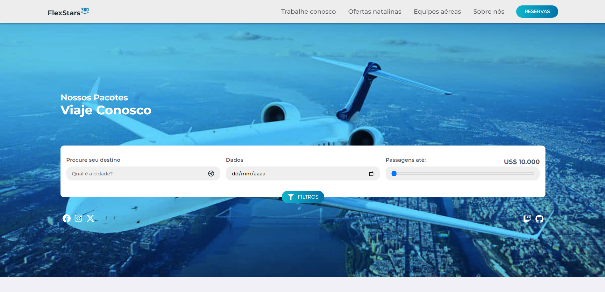

# FlexStars

Este projeto é um site de viagens desenvolvido utilizando ReactJS. O objetivo principal é proporcionar aos usuários uma plataforma intuitiva e atraente para explorar destinos de viagem, visualizar informações sobre locais turísticos, e planejar suas próximas aventuras.

## Conhecimentos utilizados

 
  
  
  
  
  

## PROJETO FINALIZADO

